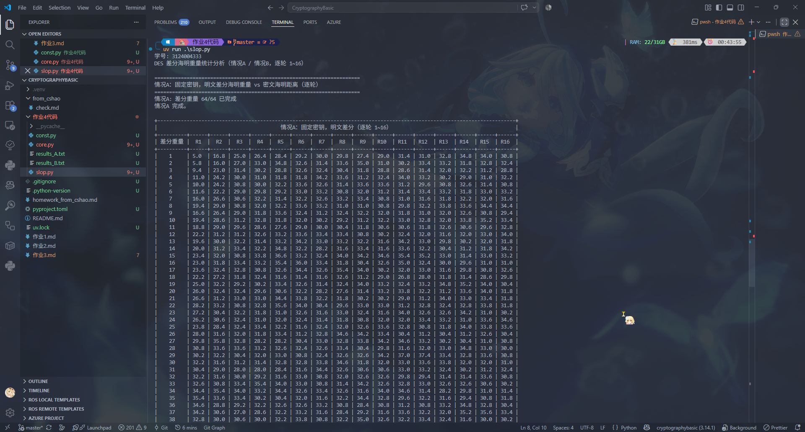
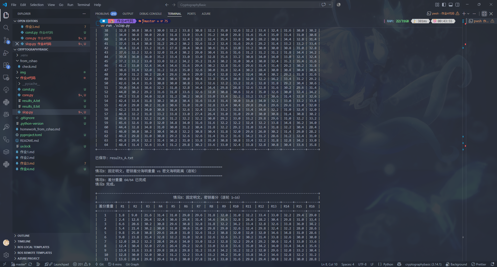
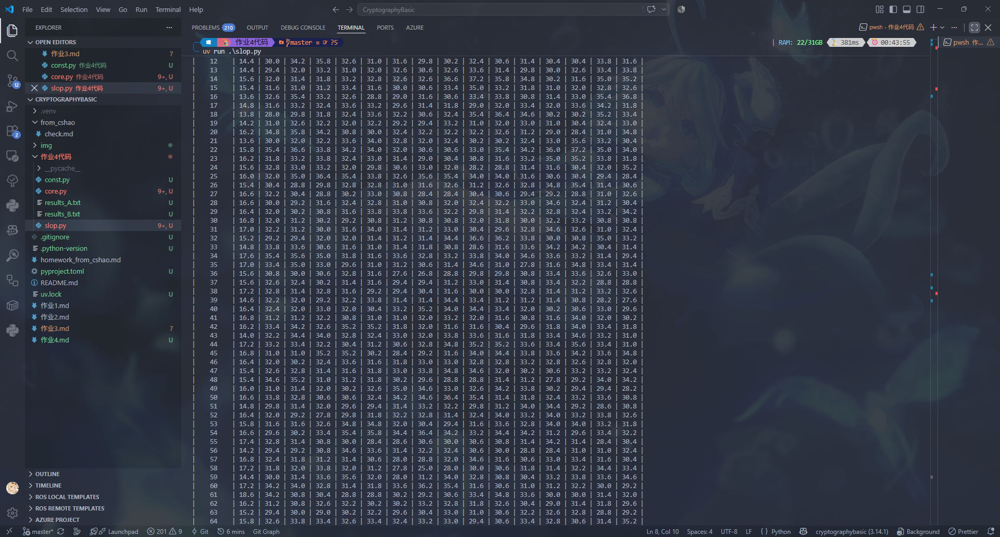

# 作业4

两个相同长度的位串m1与m2的异或结果称为它们的差分。 位串m中1的个数称为m的海明重量，简称重量。

1. 在项目根目录下增加git忽略文件，该文见的内容可以参见 https://10.21.21.251/cshao/git-gitlab-faq/-/blob/master/doc/git-ignore.md
2. 网上搜索DES的源代码，也可以自己实现DES源代码。
3. 利用 DES 源代码，编程实现下面内容。
4. 作业文档使用md格式保存信息，文件名为“作业4.md”
5. 截图时，输出信息的第一行必须是自己的个人信息（比如学号），

统计分析： 
 A： 在密钥k固定的情况下，两个分组 m1 ,m2 的差分海明重量分别是1，2，3,,,,64的情况下，m1,m2对应DES密文C1,C2的海明重量情况。
 B： 在明文m固定的情况下，两个密钥 k1 ,k2 的差分海明重量分别是1，2，3,,,,64的情况下，m 对应DES密文C1,C2的海明重量情况。

对于A，B两种情况下，需要分析（分别给出）第1轮后，第2轮后，，，，第16轮后的结果。

另外，为了公允起见，每种情况下可以多进行几组，然后求平均值。   

注意：一定要在项目根目录下添加git忽略文件，不同语言的忽略文件模板下载 ： https://10.21.21.251/cshao/gitignore 或网上搜索

## 作业解答

