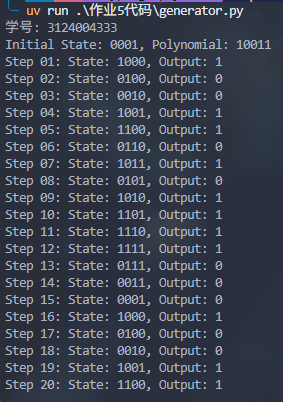

# 作业5

## LSR编程

1. 根据教材图示，编程实现线性移位寄存器随机序列生成器。
2. 内部状态个数由输入的连接多项式决定，可以输入起始状态。比如可以用字符串1011表示连接多项式 x^4+x+1。
3. 撰写设计和运行结果报告，使用md格式保存信息，文件名为“作业5.md”
4. 截图时，输出信息的第一行必须是自己的个人信息（比如学号）

## 个人解答

按照书上 P154 的例 5-1，以四位线性移位寄存器为例，设本原多项式为 GX，初始状态为 `0b0001`，则可以得到

```python
DEFAULT = 0b0001
GX = 0b10011


def linear_left_rotate(state: int, g: int) -> tuple[int, int]:
    """线性移位寄存器函数
    g(x) = g_n * x^n + g_(n-1) * x^(n-1) + ... + g_1 * x + g_0
    根据书上的图，规定寄存器只有 4 位，s3 -> s0 分别代表最高位到最低位

    Args:
        state: 当前状态
        g: 本源多项式 10011 => g(x) = x^4 + x + 1
    """
    feedback = 0
    for i in range(4):
        if (g >> i) & 1:
            feedback ^= (state >> i) & 1
    output = feedback
    newstate = (state >> 1) | (feedback << 3)
    return newstate, output


if __name__ == "__main__":
    print("学号: 3124004333")
    state = DEFAULT
    print(f"Initial State: {bin(state)[2:].zfill(4)}, Polynomial: {bin(GX)[2:].zfill(5)}")
    for i in range(20):
        state, out = linear_left_rotate(state, GX)
        print(
            f"Step {str(i+1).zfill(2)}: State: {bin(state)[2:].zfill(4)}, Output: {out}"
        )
```

首先设计一个反馈 `feedback` 为每一次的输出，先初始化为 0，然后开始提取各个数位，这里采用移位后与 1 的方式进行提取了

因为这里的数位只有 4 位，所以 range 的范围是 0~3，体现到代码中就是 `range(4)`；然后每一个循环中判断对应的这一位本原多项式中的位置是不是 `1`，如果是 1 则接入 XOR，于是就写成了

```python
for i in range(4):
    if (g >> i) & 1:
        feedback ^= (state >> i) & 1
```

在左右的 XOR 完成后，这里的反馈就计算完了，顺带把输出设置为 `feedback` 的值，然后下一步进行状态的更新

因为这里做的是向右线性移位寄存器，所以应当把上一个状态向右移动一位，此时 s3 经过向右移动后结果为 `0`

但是对于 s3 这个地方，由图可得反馈会给到 s3，所以这里将 `feedback` 左移三位后跟中间态进行或运算，即 `s3_tmp` 和 `feedback` 其中一个为 `1`，那么 `s3` 的值就是 `1`，最终得到了 `newstate`

然后来一个惯例截图


