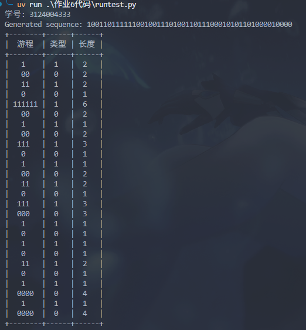
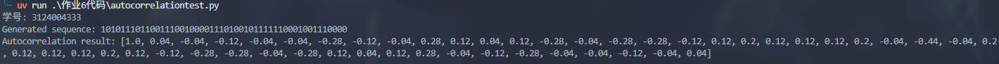
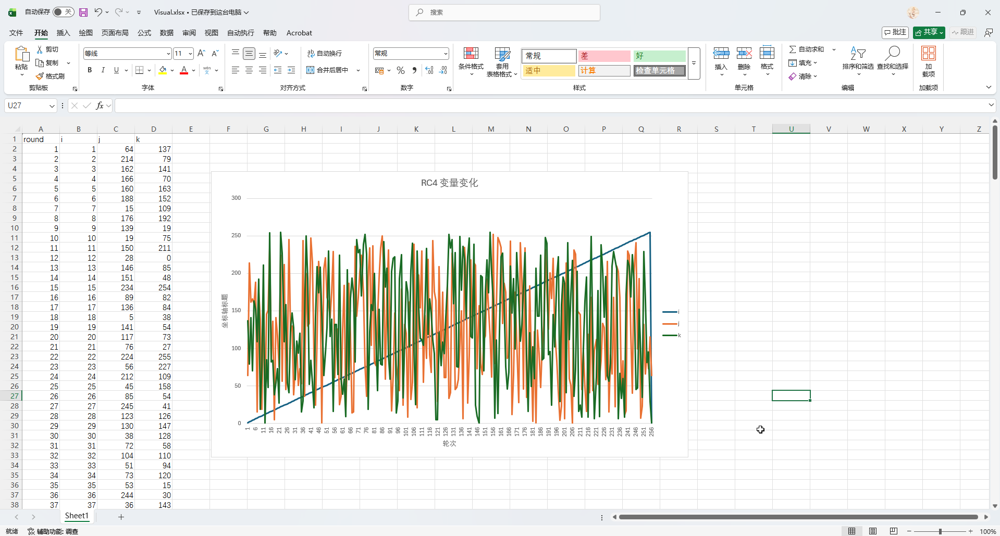

# 作业6

## 题目

### 随机性测试编程

1. 网上搜集《随机性测试规范》相关资料。 查找 C，Java或其他编程语言中随机数生成器的源代码。
2. 编程实现随机序列的
    1. 游程分布检测
    2. 自相关检测

### RC4 编程

1. 根据教材，编写RC4算法，实现输出随机序列
2. 可视化输出、观察 I，J, K的变化规律，
3. 利用编写的随机序列检测方法检测随机性，比如输出1000字节。

先将I，J，K数据输出到文本文件中，再使用Excel可视化数据并截图。

## 个人解答

### 随机性测试编程

#### random 实现

1. C 语言中 random 的实现如下

- https://github.com/gcc-mirror/gcc/blob/master/libiberty/random.c#L371

```c
long int
random (void)
{
  if (rand_type == TYPE_0)
    {
      state[0] = ((state[0] * 1103515245) + 12345) & LONG_MAX;
      return state[0];
    }
  else
    {
      long int i;
      *fptr += *rptr;
      /* Chucking least random bit.  */
      i = (*fptr >> 1) & LONG_MAX;
      ++fptr;
      if (fptr >= end_ptr)
	{
	  fptr = state;
	  ++rptr;
	}
      else
	{
	  ++rptr;
	  if (rptr >= end_ptr)
	    rptr = state;
	}
      return i;
    }
}
```

是通过 `state[0] * 1103515245 + 12345` 的结果跟 `LONG_MAX` 进行与操作得到的，与操作是为了避免超出 `long` 类型的范围

Java 是这样写的 

- https://github.com/openjdk/jdk/blob/master/src/java.base/share/classes/java/util/Random.java

```java
    public Random() {
        this(seedUniquifier() ^ System.nanoTime());
    }

    private static long seedUniquifier() {
        // L'Ecuyer, "Tables of Linear Congruential Generators of
        // Different Sizes and Good Lattice Structure", 1999
        for (;;) {
            long current = seedUniquifier.get();
            long next = current * 1181783497276652981L;
            if (seedUniquifier.compareAndSet(current, next))
                return next;
        }
    }

    private static final AtomicLong seedUniquifier
            = new AtomicLong(8682522807148012L);
```

通过获取当前的 `seedUniquifier`（上面给了一个默认值），跟一个超大的数字 `1181783497276652981L` 相乘后，再跟当前的系统时钟异或以下出来的

#### 随机序列检测

1. 游程分布检测

其实很简单，直接检测连续的段即可

```python
def runtest(array: list[int]) -> list[tuple[list[int], str, int]]:
    """游程分布检测

    Args:
        array (list[int]): 输入的生成随机数序列
    """
    results = []
    previous = array[0]
    this_array = []
    run_length = 1
    for i in array:
        if i == previous:
            run_length += 1
            this_array.append(i)
        else:
            run_type = "0" if previous == 0 else "1"
            results.append(("".join(map(str, this_array)), run_type, run_length))
            previous = i
            run_length = 1
            this_array = [i]
    # 最后一个
    run_type = "0" if previous == 0 else "1"
    results.append(("".join(map(str, this_array)), run_type, run_length))
    return results
```



2. 自相关检测

对整个序列进行移动后逐位对比即可

```python
def autocorrelation(array: list[int]) -> list[float]:
    N = len(array)
    result: list[float] = []
    for k in range(N):
        s = 0
        for i in range(N):
            a = 1 if array[i] == 0 else -1
            b = 1 if array[(i + k) % N] == 0 else -1
            s += a * b
        result.append(s / N)
    return result
```



### RC4

代码在 [作业6代码/rc4.py](./作业6代码/rc4.py) 里面

其中注意到书上写的是 `CIPERTEXT[I] = PLAINTEXT[I] + KEYSTREEAM[I] MOD 2`，但是实际的 RC4 应该是 `plaintext[i] ^ keystream[i]`，这里进行了一个模 2 处理，会导致最后的加密结果丢失信息


